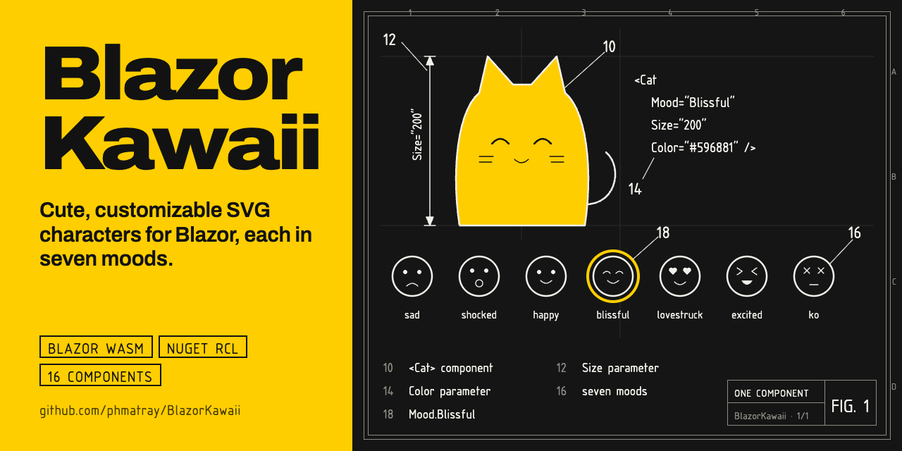
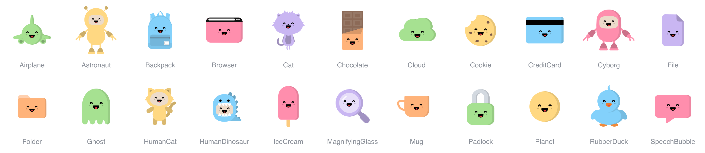

# 🌸 BlazorKawaii

<!-- portfolio-toc:start -->

## Table of Contents

- [✨ Features](#-features)
- [🚀 Getting Started](#-getting-started)
- [📖 Usage](#-usage)
- [🏗️ Architecture](#-architecture)
- [🛠️ Development](#-development)
- [Tech Stack](#tech-stack)
- [🗺️ Roadmap](#-roadmap)
- [🤝 Contributing](#-contributing)
- [📄 License](#-license)
- [🙏 Acknowledgments](#-acknowledgments)
- [🚀 GitHub Pages Deployment](#-github-pages-deployment)
- [📞 Support](#-support)

<!-- portfolio-toc:end -->


Cute, customizable SVG mascots for Blazor — drop a smiling cloud into your offline screen, a curious magnifying glass into an empty search, or a sad folder into a file list with nothing in it.

Based on the wonderful [React Kawaii](https://react-kawaii.vercel.app/) library by [Miuki Miu](https://github.com/miukimiu), BlazorKawaii brings these adorable, expressive components to the .NET ecosystem — and adds a few mascots of its own.

[](https://www.nuget.org/packages/BlazorKawaii/)


[](https://phmatray.github.io/BlazorKawaii/)



## ✨ Features

- 🎨 **24 Kawaii Components** — 16 ported from React Kawaii, plus 8 BlazorKawaii originals made for everyday UI states: Airplane, Cassette, Cloud, Cookie, Gamepad, Magnifying Glass, Padlock, and Rubber Duck
- 😊 **9 Mood Expressions**: Sad, Shocked, Happy, Blissful, Lovestruck, Excited, Ko, Sleepy, and Dizzy
- 🎯 **Fully Customizable**: size, color, and mood on every component, plus CSS hooks on the wrapper and the SVG
- 📱 **Pure SVG**: crisp at any size, no images or JavaScript
- 🧩 **Isolated instances**: each component gets unique SVG mask IDs, so any number can share a page
- 🌐 **Culture-safe rendering**: SVG numbers are always formatted with the invariant culture
- ♿ **Accessible by default**: mascots are hidden from screen readers unless you give them a `Title`
- 📦 **NuGet Package**: a Razor Class Library with XML docs for IntelliSense and SourceLink

The [demo app](https://phmatray.github.io/BlazorKawaii/) adds a component gallery, an interactive playground, and documentation in English, French, Spanish, and Dutch.

## 🚀 Getting Started

### Prerequisites

- .NET 10 SDK or later
- Visual Studio 2026, Visual Studio Code with C# Dev Kit, or JetBrains Rider

### Installation

#### Option 1: Install from NuGet (Recommended)

```bash
dotnet add package BlazorKawaii
```

Then add the namespaces to your `_Imports.razor`:

```razor
@using BlazorKawaii.Components
@using BlazorKawaii.Common
```

#### Option 2: Clone and Run the Demo

```bash
git clone https://github.com/phmatray/BlazorKawaii.git
cd BlazorKawaii
dotnet run --project Demo/Demo.csproj
```

Then open `https://localhost:7195`.

## 📖 Usage

### Basic Usage

```razor
<Cat Mood="Mood.Blissful" Size="200" Color="#596881" />
```

### Parameters

Every component inherits `KawaiiComponentBase` and shares the same parameters:

| Parameter  | Type      | Default          | Description                                   |
|------------|-----------|------------------|-----------------------------------------------|
| `Size`     | `int`     | `240`            | Width and height in pixels                    |
| `Mood`     | `Mood`    | `Mood.Blissful`  | Facial expression                             |
| `Color`    | `string?` | `#A6E191`        | Main body color (any CSS color)               |
| `Class`    | `string?` | —                | CSS class on the wrapper `div`                |
| `Style`    | `string?` | —                | Inline style on the wrapper `div`             |
| `SvgClass` | `string?` | —                | CSS class on the `svg` element                |
| `SvgStyle` | `string?` | —                | Inline style on the `svg` element             |
| `Title`    | `string?` | —                | Accessible name; without it the mascot is decorative (`aria-hidden`) |
| `Animated` | `bool`    | `false`          | Plays the built-in animation of the mood (see [Animation](#animation)) |

Any other attribute, such as `aria-label` or `data-testid`, is passed through to the `svg` element.

### Components

| Family    | Components                                                         |
|-----------|--------------------------------------------------------------------|
| Creatures | `Cat`, `Ghost`, `Astronaut`, `Cyborg`, `HumanCat`, `HumanDinosaur`, `RubberDuck` |
| Food      | `Chocolate`, `Cookie`, `IceCream`, `Mug`                           |
| Interface | `Browser`, `CreditCard`, `File`, `Folder`, `Gamepad`, `MagnifyingGlass`, `Padlock`, `SpeechBubble` |
| World     | `Airplane`, `Backpack`, `Cloud`, `Planet`                          |

Fixed details such as chocolate chips, a duck's bill, or a padlock's shackle keep their own colors; `Color` tints the body.

### Moods

```csharp
public enum Mood
{
    Sad,
    Shocked,
    Happy,
    Blissful,
    Lovestruck,
    Excited,
    Ko,
    Sleepy,
    Dizzy
}
```

### Mascots for UI States

Pair a mascot and a mood with the state your user is in:

| State                      | Suggestion                                   |
|----------------------------|----------------------------------------------|
| Search with no results     | `<MagnifyingGlass Mood="Mood.Shocked" />`    |
| Offline or sync failure    | `<Cloud Mood="Mood.Sad" />`                  |
| Sign-in or access denied   | `<Padlock Mood="Mood.Ko" />`                 |
| Cookie consent banner      | `<Cookie Mood="Mood.Blissful" />`            |
| Unexpected error           | `<RubberDuck Mood="Mood.Sad" />`             |
| Booking or shipping status | `<Airplane Mood="Mood.Excited" />`           |
| Empty file list            | `<Folder Mood="Mood.Sad" />`                 |
| Idle or session expired    | `<Ghost Mood="Mood.Sleepy" />`               |
| Too many retries or a confusing error | `<Cloud Mood="Mood.Dizzy" />` |

```razor
@if (!results.Any())
{
    <div class="empty-state">
        <MagnifyingGlass Mood="Mood.Shocked" Size="160" Color="#83D1FB" />
        <p>No results for “@query”</p>
    </div>
}
```

### Styling Example

```razor
@foreach (var mood in Enum.GetValues<Mood>())
{
    <Ghost Mood="@mood" Size="150" Color="@GetColorForMood(mood)" SvgClass="floating" />
}

@code {
    private static string GetColorForMood(Mood mood) => mood switch
    {
        Mood.Sad => "#B0C4DE",
        Mood.Happy => "#98FB98",
        Mood.Lovestruck => "#FFB6C1",
        _ => "#E0E4E8"
    };
}
```

### Face only

`KawaiiFace` renders just the eyes, blush and mouth in a tight, transparent SVG, to lay over your own artwork (a photo, an avatar, a background). `Size` is the width of the face's box in pixels (the box leaves room for every mood, so the face does not move when `Mood` changes), you position it with CSS, `Color` sets the eyes and the mouth (black by default) and `BlushColor` the cheeks.

```razor
<div style="position: relative">
    
    <KawaiiFace Mood="Mood.Excited"
                Size="120"
                Color="#FFFFFF"
                BlushColor="#FF8FB1"
                Style="position:absolute; left:50%; top:45%; transform:translate(-50%,-50%)" />
</div>
```

### Animation

`Animated="true"` plays a small animation chosen by the mood. It needs no stylesheet: the face carries its own `<style>`.

| Mood | Animation |
|------|-----------|
| `Happy`, `Sad`, `Shocked`, `Excited` | The eyes blink every few seconds |
| `Excited` | The face hops |
| `Sad` | The face droops |
| `Blissful` | The face rocks gently and the cheeks glow |
| `Lovestruck` | The face floats and the heart eyes beat |
| `Ko` | The head sways and the cross eyes spin |
| `Sleepy` | The head nods and the mouth snores |
| `Dizzy` | The spiral eyes spin |

Nothing moves when the visitor's system asks for reduced motion (`prefers-reduced-motion: reduce`).

To animate a part yourself, target the classes every face carries, on `KawaiiFace` and every mascot alike:

| Class | Element |
|-------|---------|
| `kawaii-face` | The face's root group |
| `kawaii-face--<mood>` | The same group, with the mood in lower case (`kawaii-face--happy`, `kawaii-face--ko`, …) |
| `kawaii-face--animated` | The same group, when `Animated` is on |
| `kawaii-face__eyes`, `kawaii-face__mouth`, `kawaii-face__cheeks` | The three parts |

```css
.peeking .kawaii-face__eyes {
    transform-box: fill-box;      /* move the eyes around their own centre */
    transform-origin: center;
    animation: peek 2.4s ease-in-out infinite;
}
```

```razor
<Cat Mood="Mood.Happy" Class="peeking" />
```

## 🏗️ Architecture

### Component Structure

Each kawaii component follows the same pattern:

```
BlazorKawaii/Components/
└── ComponentName/
    ├── ComponentName.razor      # SVG markup inside the Wrapper
    ├── ComponentName.razor.cs   # Partial class: default color and face placement
    └── ComponentNamePaths.cs    # SVG body markup as a constant
```

### Shared Building Blocks

- **KawaiiComponentBase**: common parameters, unique instance IDs, and the abstract face placement
- **Face**: renders the eyes, mouth, and blush for each mood
- **Wrapper**: container for consistent positioning
- **SvgMaskHelper** / **SvgFormatHelper**: unique mask IDs and culture-invariant numbers

## 🛠️ Development

### Building the Project

```bash
dotnet build
```

### Running in Development Mode

```bash
dotnet watch run --project Demo/Demo.csproj
```

### Creating a New Component

1. Create `BlazorKawaii/Components/[Name]/`
2. Add `[Name]Paths.cs` with the SVG body in a `Body` constant, using `currentColor` for the tintable parts
3. Add `[Name].razor` following the Wrapper pattern of an existing component such as `Mug`
4. Add `[Name].razor.cs` inheriting `KawaiiComponentBase`
5. Add it to `Demo/Shared/KawaiiCatalog.cs` and add a `[Name]Desc` entry to the four `Demo/Resources/SharedResource*.resx` files: the gallery, playground, and documentation all read that catalog

```csharp
public partial class NewComponent : KawaiiComponentBase
{
    protected override string DefaultColor => "#A6E191";

    // Face width in the 240×240 viewBox divided by the Face's native width (66)
    protected override double GetFaceScale() => 56 / 66.0;

    // Top-left corner of the face in the 240×240 viewBox
    protected override (double x, double y) GetFacePosition() => (92, 120);
}
```

<!-- portfolio-techstack:start -->

## Tech Stack

- **.NET 10**
- Microsoft.AspNetCore.Components.Web
- Microsoft.AspNetCore.Components.WebAssembly
- Microsoft.AspNetCore.Components.WebAssembly.DevServer
- Microsoft.AspNetCore.WebUtilities
- MudBlazor
- PublishSPAforGitHubPages.Build
- Microsoft.Extensions.Localization

<!-- portfolio-techstack:end -->

## 🗺️ Roadmap

- [ ] Track new components and moods as they're added to the upstream [React Kawaii](https://react-kawaii.vercel.app/) library
- [ ] Add a bUnit test project to cover component rendering and parameter binding
- [ ] Add more locales beyond the current English, French, Spanish, and Dutch
- [ ] Support custom theming (palettes) beyond the single `Color` parameter

See the [open issues](https://github.com/phmatray/BlazorKawaii/issues) for what's currently planned.

## 🤝 Contributing

Contributions are welcome! Please feel free to submit a Pull Request. For major changes, please open an issue first to discuss what you would like to change.

### Guidelines

1. Follow the existing component structure
2. Keep the house style: flat shapes, no outlines, light from the left with a soft shadow inside the right edge
3. Make sure all nine moods read well on your mascot, in light and dark themes
4. Add your component to `Demo/Shared/KawaiiCatalog.cs` and describe it in the four resource files
5. Update the README

## 📄 License

This project is licensed under the MIT License - see the [LICENSE](LICENSE) file for details.

## 🙏 Acknowledgments

- **Original Project**: [React Kawaii](https://react-kawaii.vercel.app/) by [Miuki Miu](https://github.com/miukimiu)
  - The 16 ported components, the face, and the moods are faithful adaptations of Miuki Miu's designs
  - Licensed under MIT License
- Airplane, Cassette, Cloud, Cookie, Gamepad, Magnifying Glass, Padlock, and Rubber Duck are BlazorKawaii originals drawn in the same style
- Built with [Blazor](https://dotnet.microsoft.com/apps/aspnet/web-apps/blazor) and [MudBlazor](https://mudblazor.com/) for the demo
- Adapted for .NET by [Philippe Matray](https://github.com/phmatray)

## 🚀 GitHub Pages Deployment

The demo is published to GitHub Pages at <https://phmatray.github.io/BlazorKawaii/>.

### Automatic Deployment

The release workflow (`.github/workflows/release-please.yml`) deploys the demo to the `gh-pages` branch with every release, so the live demo always matches the published package.

To set it up on a fork, open **Settings › Pages**, choose **Deploy from a branch**, then select the `gh-pages` branch and the `/ (root)` folder.

### Manual Deployment

```bash
# Publish with the GitHub Pages configuration
dotnet publish Demo/Demo.csproj --configuration Release --output ./dist -p:GHPages=true

# The site is in ./dist/wwwroot
```

## 📞 Support

- Create an issue for bug reports or feature requests
- Check out the [live demo](https://phmatray.github.io/BlazorKawaii/) for examples
- See [CLAUDE.md](CLAUDE.md) for AI-assisted development guidelines

---

Made with ❤️ and Blazor

<!-- portfolio-nugetkeep:start -->
---
Built by [Atypical Consulting](https://www.atypical.consulting). We also make
[NuGetKeep](https://nugetkeep.com/?utm_source=github-readme&utm_medium=readme&utm_campaign=launch-2026-07),
a self-hosted NuGet server with supply-chain quarantine.
<!-- portfolio-nugetkeep:end -->
